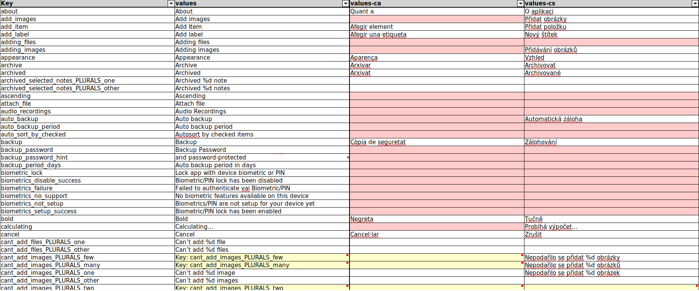

# AndroidExcelConverter

Inspired By: [android-strings-export](https://github.com/shahimclt/android-strings-export)

Python scripts to automate importing and exporting Android translations (`strings.xml` files) to Excel and back.

## Export

To export all Translations to an Excel file:
```shell
 python -m pip install -r ./requirements.txt
 python ./export.py <Android Project Path>/app/src/main/res/ ./translations.xlsx
```

### Generated Excel



- Column headers with the respective language ISO-Codes/Android-Resource folder names
- Missing translations are marked in red
- Key and default language columns are pinned
- Non-Translatable strings are hidden and marked in gray
- For plural strings there are separate rows for each possible `quantity` (`few`, `many`, `one`, `other`, `two`, `zero`), if the default language does not need/have a translations for a specific quantity, the row is highlighted in yellow

Example generated Excel file: [translations.xlsx](./translations.xlsx)

## Import

To import `strings.xml` for all languages from Excel file:
```shell
 python ./import.py ./translations.xlsx <Android Project Path>/app/src/main/res/
```
- Creates a `strings.xml` per Excel Sheet column (= language) in the corresponding `values-{language}` folder 
- All `strings.xml` contents are sorted alphabetically by their key names

### Libraries
- [pandas](https://pandas.pydata.org/)
- [openpyxl](https://openpyxl.readthedocs.io/en/stable/)
- [lxml](https://lxml.de/)